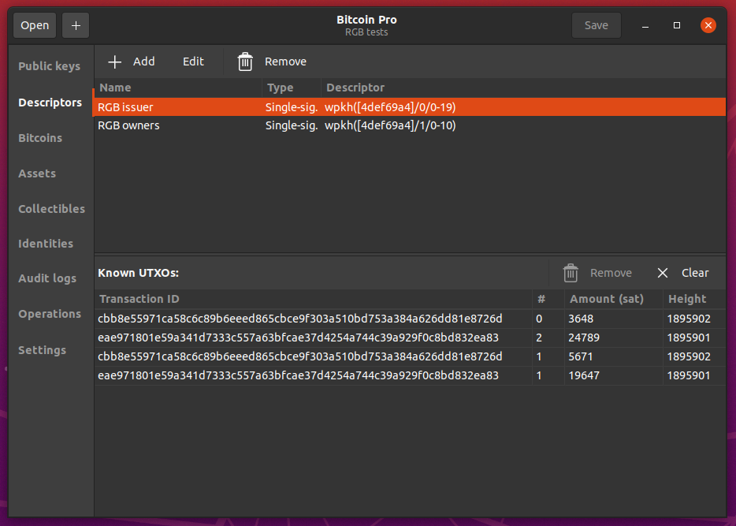
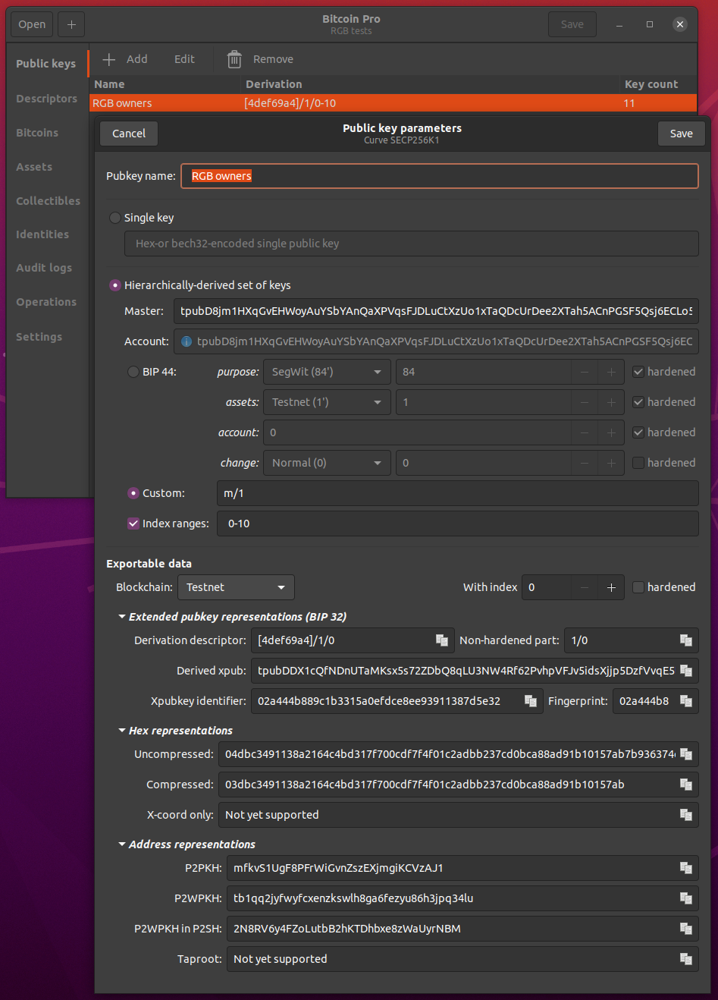
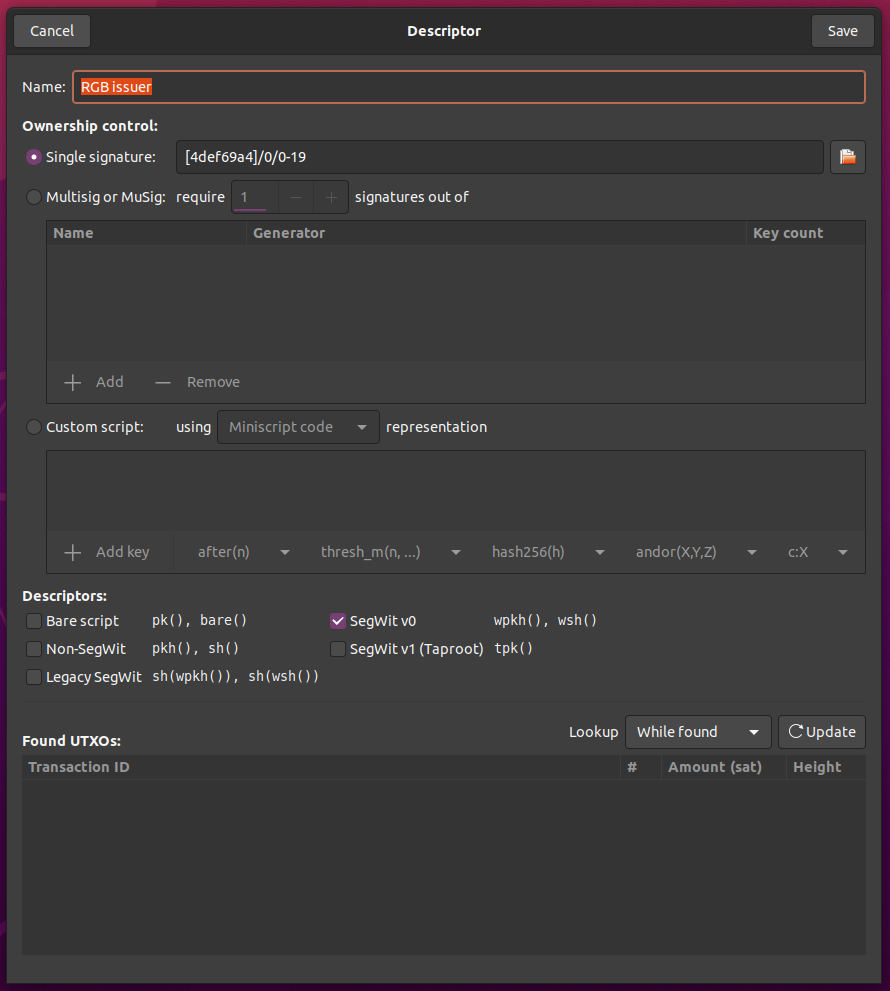
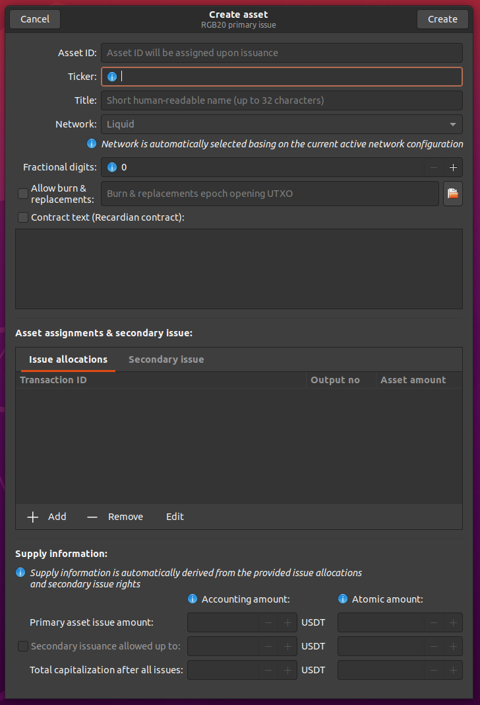

# Bitcoin Pro

Professional bitcoin accounts & smart contract management by 
[Pandora Cora AG](https://pandoracore.com), Switzerland & Dr. Maxim Orlovsky.

Application is founded on [LNP/BP Core Library](https://github.com/LNP-BP/rust-lnpbp)
and allows [RGB smart contracts](https://rgb-org.github.com) management.

The application **is not a bitcoin wallet**: it does not require access to 
private keys or creates any signatures. All operations are saved & exported in 
form of PSBTs (partially-signed bitcoin transactions) and for their completion
must be signed and published to bitcoin network outside of the application.

Bitcoin Pro is written exclusively in Rust language with GTK framework and 
natively compiles/works on Linux, MacOS and (probably) Windows 10.

NB: This is an ultra-early alpha version; use it at your own risk!

## Features

* Extended public key management [Completed]
* Creation of arbitrary complex descriptors monitoring onchain transactions [WIP]
* Creation and management of RGB fungible assets (RGB-20 standard) [WIP]
  - Secondary issuances
  - Renominations
  - Burn & replacement
* Creation and management of RGB collectibles/non-fungible token contracts 
  (RGB-21 standard) [Planned]

## Installation

Install rust language and run

```constole
$ cargo install bitcoin-pro
$ bitcoin-pro
```

## Main interface



## Extended public key management



## Output descriptors



## RGB-20 assets


